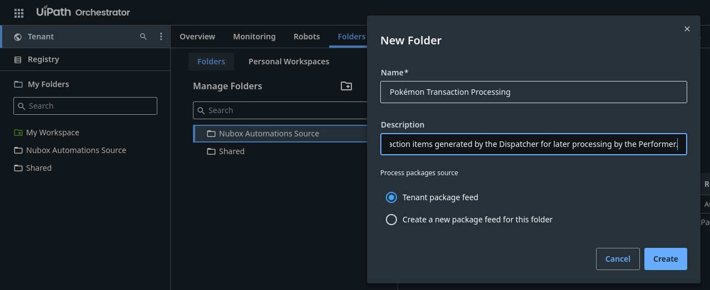
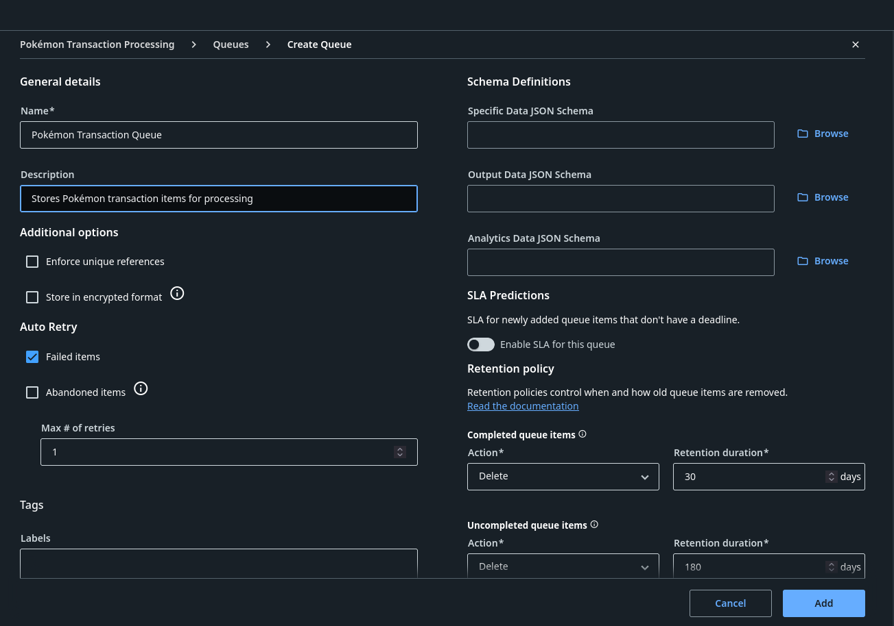
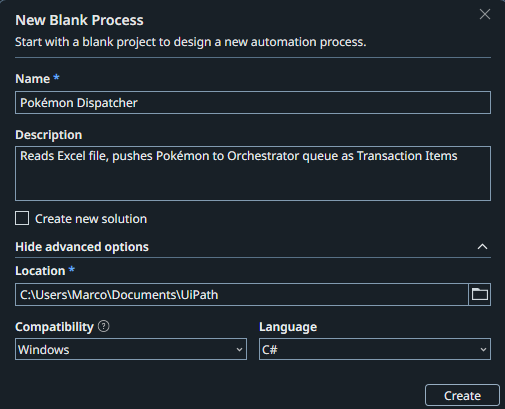
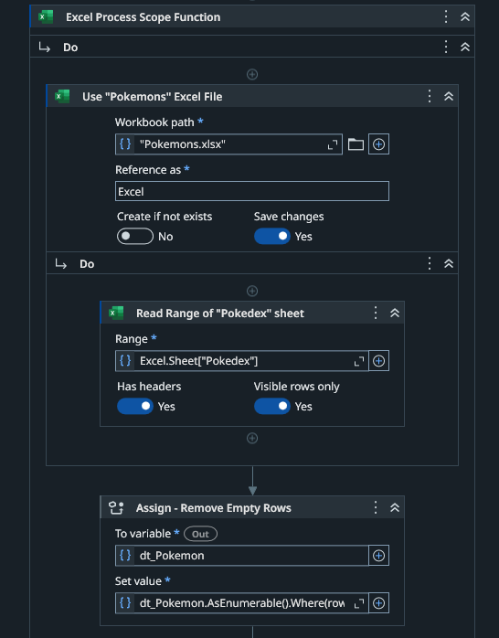
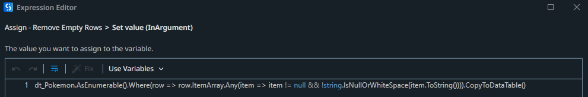
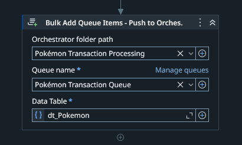
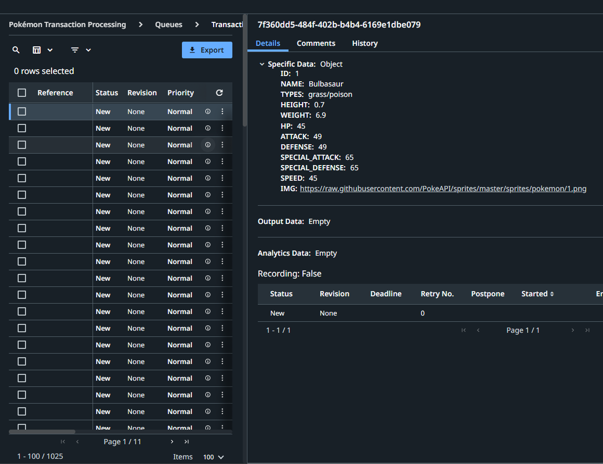

# Dispatcher Phase

This phase of the project requires an existing folder and queue in UiPath Orchestrator. A Dispatcher workflow is implemented to push each item into the Orchestrator Queue, making it available for processing in the next phase.

 

# Orchestrator Setup

 

As shown in the Tenant tab, a folder is created to store the queue and its queue items.

 

After the folder is created, it is necessary to create the queue inside it, as shown.

 

# Creating Dispatcher Workflow
 

The Dispatcher workflow is created in UiPath Studio.

 

This phase reads the Excel file using an `Excel Process Scope` activity. Inside this scope, a `Use Excel File` activity contains a `Read Range` activity that reads data from the first worksheet of the Excel file and stores it in a DataTable variable called `dt_Pokemon`.

The current workflow already includes a sample `Pokémon Excel` file as a dependency.

During testing of this project, some empty transactions were being uploaded to Orchestrator. To prevent this, after the data is stored in the `dt_Pokemon` variable, a filter expression is applied to retain only rows containing data and remove any empty rows.

The filter expression shown in detail

 

The DataTable variable is passed to the `Bulk Add Queue Items` activity which uploads the items to the previously created Orchestrator Folder and Queue.

# Orchestrator Output
 

After running the workflow, all rows are added as transaction items in Orchestrator. The data is now ready for the Performer phase.

