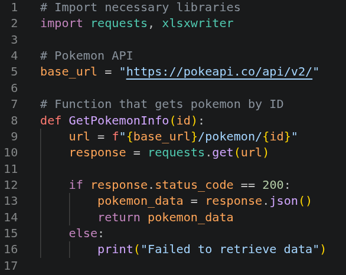
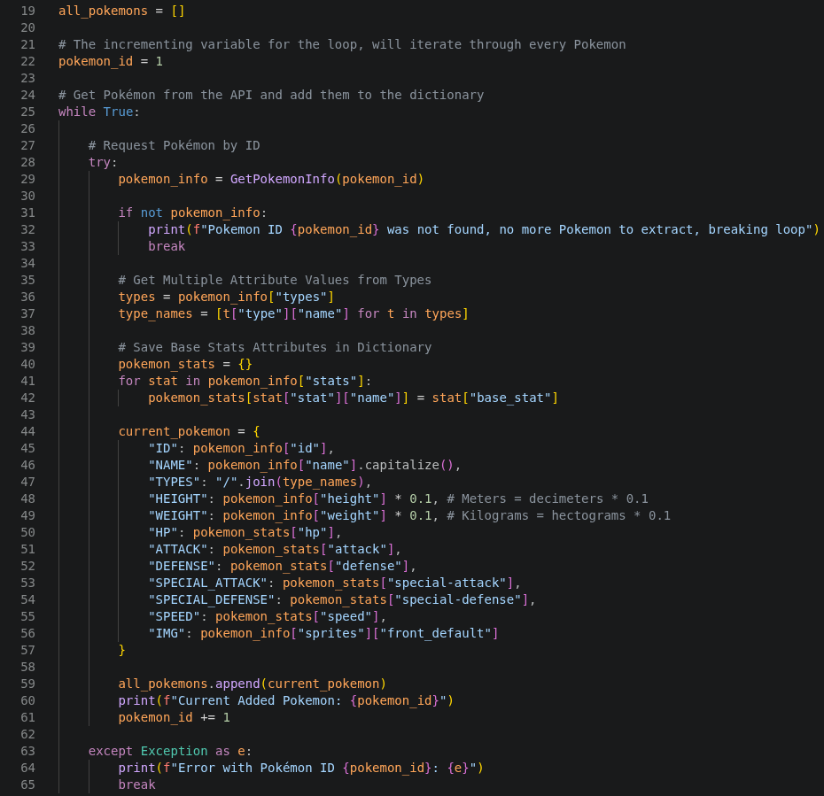
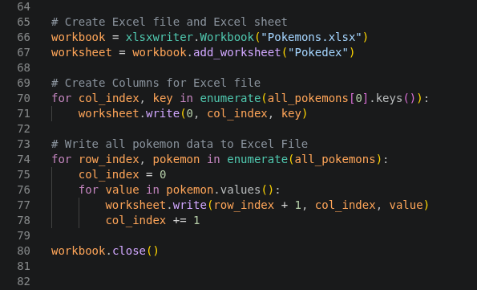
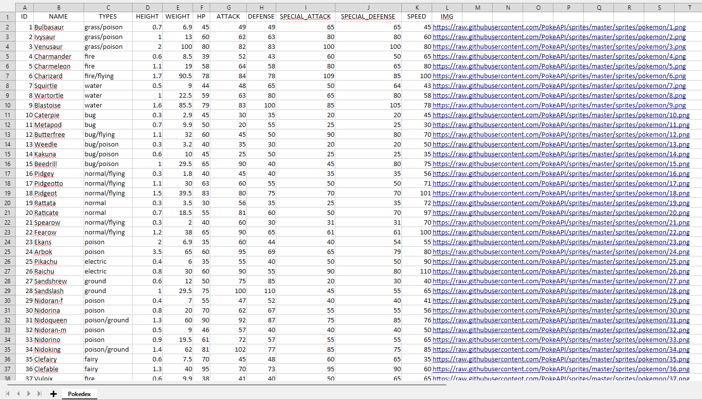

# Input Phase

This Input Phase consists of several steps: calling an external API, retrieving the data, formatting it, and storing it in a collection. The collected data is then written to an Excel file for further use. This phase is implemented in Python due to its simple syntax and useful set of libraries that support data handling and API integration.

 

# Imports, Libraries and Function 

This phase starts by importing `requests` and `xlsxwriter` libraries. `Requests` is for calling the API and retrieve a JSON response, on the other hand `xlsxwriter` is used later to create an Excel file and then using its methods to write the Pokémon data down into an Excel sheet.

 

  

After importing the libraries, then it creates a function that retrieves Pokémon by id, it uses the `base_url` as our API and expects an integer `id` as its argument. This will allow us to efficiently fetch each Pokémon through a loop.

 

# Adding Data to Collection and Iterating Through IDs

 

A list called `all_pokemons` is created to store Pokémon data. Each Pokémon is represented as a dictionary and is added to this list.

Then, an integer variable named `pokemon_id` is initialized. This variable acts as an incremental counter used to iterate through all possible Pokémon IDs. The process continues retrieving data for each ID until no matching Pokémon is found.

The process of calling the API `pokemon_info = GetPokemonInfo(i)` is wrapped in a `Try-Except` block in case there is an error, the exception logs the ID where the iteration failed. Then if there was no error but the ID did not match any Pokémon it breaks the loop and continues to the Excel File creation process.

After that, we have two important loops

- `type_names`: Every Pokémon has one or two types, such as "Fire", "Normal", "Steel", "Ice", etc. For this reason, the types are accessed and stored in a list before being added as a property.
  
- `pokemon_stats`: This information is stored in a dictionary, the loop access the JSON Structure and retrieves each key-value pair. Some stats are "HP", "ATTACK", "DEFENSE", "SPEED".

 

Now we create the `current_pokemon` dictionary, it will store all of the information of the current Pokémon with its appropriate key-value pair. Some attributes require additional processing:

- **NAME**: Added a .capitalize() so the names always start with a capital letter. 

- **TYPES**: as previously mentioned, the types of the current instance are stored in a list, so they are joined using a "/".

- **HEIGHT (M)**: The height was in decimeters, so by multiplying by 0.1 its now in Meters.

- **WEIGHT (KG)**: The weight was in hectograms, so by multiplying by 0.1 its now in Kilograms.

 

After assigning all attributes to the `current_pokemon` dictionary, the object is added to the `all_pokemons` collection. The process then logs the ID of the Pokémon that was added and continues with the next iteration, retrieving data for the following Pokémon ID.

 

# Exporting The Data To Excel File

When all the Pokémon have been added to the collection, it proceeds to the next step and write the data to the Excel file.

 

 

The `xlsxwriter` library is then used to create the workbook and define the worksheet. Next, the keys from the first instance of the `all_pokemons` collection are retrieved and used as the column headers for the Excel file. A `for loop` is used to dynamically retrieve these keys and write them as column headers in the worksheet.

The first `for loop` uses `enumerate()` to iterate through the `all_pokemons` collection, providing both the current row index and the Pokémon dictionary. For each Pokémon, a second for loop iterates through all dictionary values. The `col_index` variable is reset at the beginning of each iteration to ensure that data is always written starting from the first column.

The statement `worksheet.write(row_index + 1, col_index, value)` is responsible for writing the Pokémon data to the worksheet. By using the current row and column indexes, each value is automatically placed in its corresponding cell without overwriting existing data.

After all Pokémon have been processed and written to the worksheet, the workbook is finalized and closed using `workbook.close()`. At this stage, the Input Phase is complete and the generated Excel file is ready for review.

 

# Excel File Output

 

As shown above, the data has been successfully written to the Excel file. One column that may stand out is `IMG`, which contains the image URL for each Pokémon. These URLs will be used later during the output process.

In the next stage of the project, an Orchestrator Queue is created and populated with the extracted data. Each row is uploaded as a separate Queue Item and subsequently processed as an individual transaction through the REFramework, ensuring item isolation throughout the execution.
