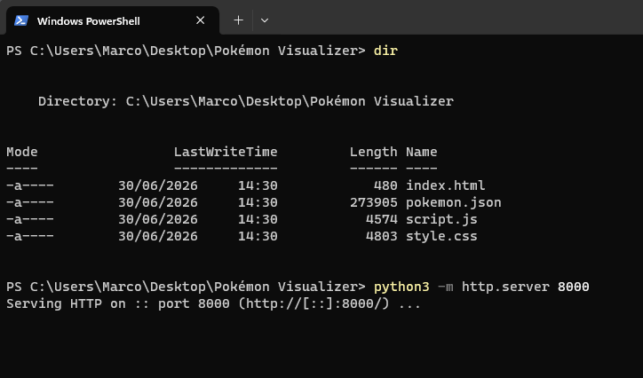
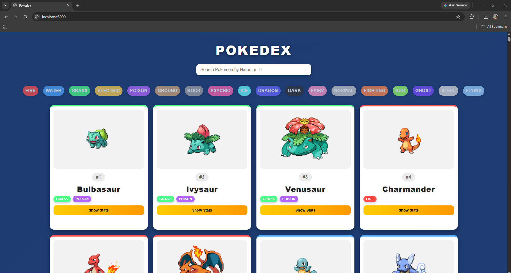
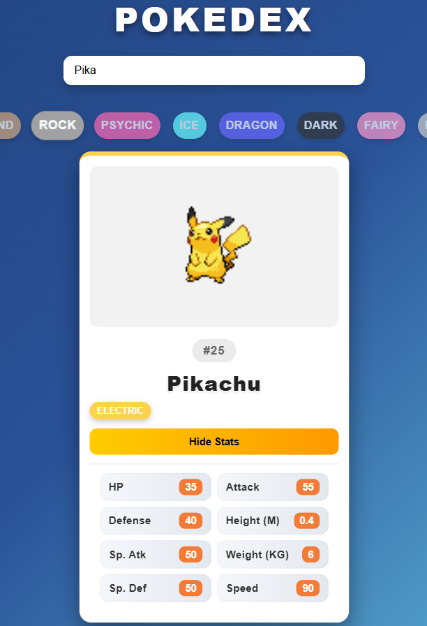
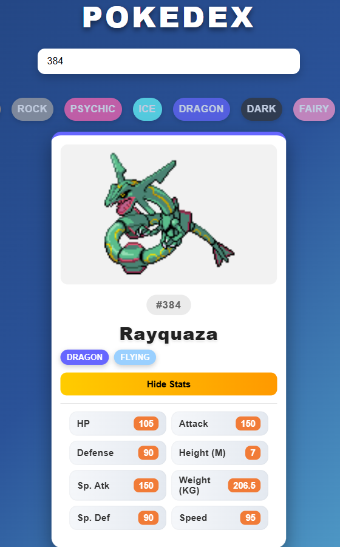
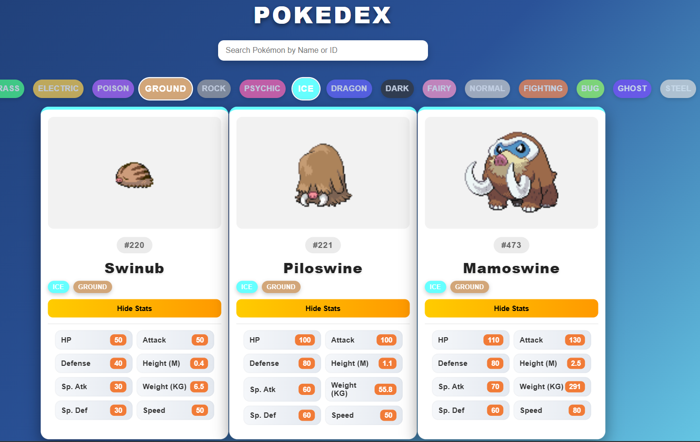

# Output Phase

In this phase, the `pokemon.json` file generated during the previous phase is used by a template web application to visualize the Pokémon data.

# Web Server Setup for Visualization

To view the project, a local web server must be started. The following example uses `Python` to create one.

After downloading the `Pokémon Visualizer` folder, open a `cmd` window or terminal and navigate to the downloaded folder. Then run the following command:

`python3 -m http.server 8000`

This starts a web server using the contents of the folder. To access the application, open a web browser and enter the following URL:

`http://localhost:8000`

Then press `Enter`.

When loaded correctly, the application should appear as shown above. By clicking the `Show Stats` button, the details of each Pokémon are displayed.

The search bar can be used to search for Pokémon by name or ID.

The filter buttons display only Pokémon that match the selected types. In the example below, the `Ground` and `Ice` types are selected.

To stop the web server, press `Ctrl + C` in the terminal or `cmd` window.

This concludes the project documentation. Thank you for reading.
