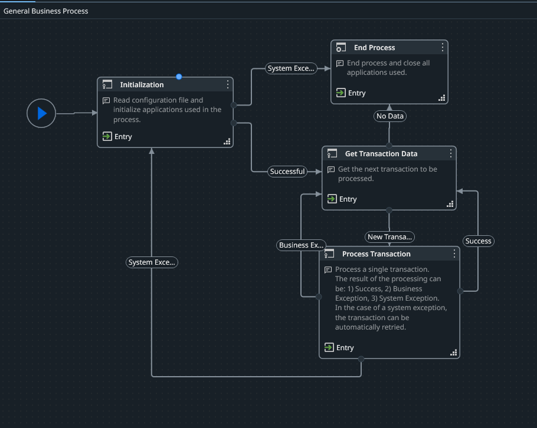
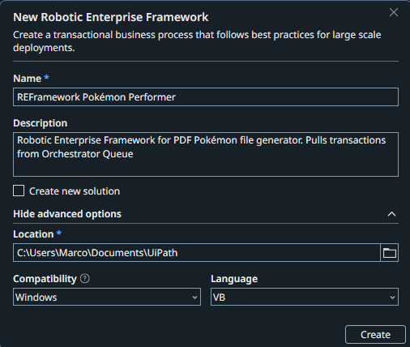
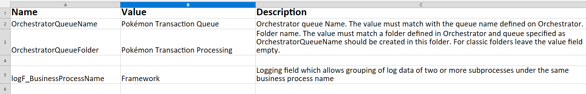
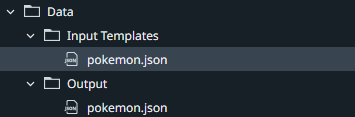
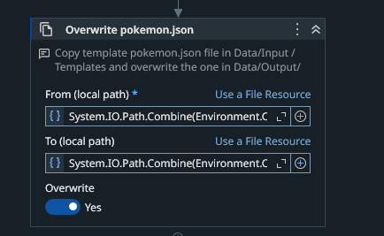
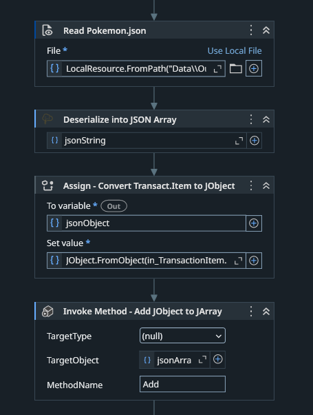
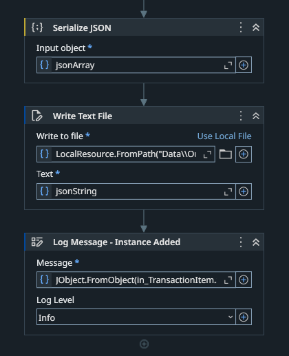

# Performer Phase

This phase uses the UiPath REFramework template for transactional queue item processing.

The template already provides a fast and structured way to implement data processing for this project, along with many additional features that are outside the scope of this documentation.
This documentation covers only the components built on top of the REFramework template.

For more information about the template, refer to the following document within this phase:

`Documentation/REFramework Documentation-EN.pdf`

This document provides a more detailed explanation of the REFramework template and its features.

 

The following diagram provides an overview of the REFramework template.

 

# Implementations Bullet List

- Config.xlsx (Settings sheet, Queue and Folder values)
- Input Templates and Output
- InitAllSettings.xaml Blank Output (Overwrite output file)
- Process.xaml (Main Workflow)

 

# REFramework Process Creation and Configurations

Start by creating the process in UiPath Studio.

 

Every REFramework project has a `Config.xlsx` file located in `Data/Config.xlsx`. In the `Settings` sheet, the project requires the Folder and Queue values created in Orchestrator during the previous phase.

After setting up these values, the project uses an input template and an output file, as shown below:

 

There are two `pokemon.json` files. The one in the `Input Templates` folder contains an empty JSON array, while the one in the `Output` folder is the file that is modified during execution.

At the start of every run, the `InitAllSettings.xaml` file (located in `Framework/InitAllSettings.xaml`) copies the input template file and overwrites the output file. This ensures that the output file is always reset and empty at the beginning of each process execution, as shown below:

 

As for the transaction processing logic, the code is located in `Framework/Process.xaml`.

 

Then, the file from the `Output` folder is read and deserialized into a `JSON array`. After that, the `transaction item` is converted into a `JSON object`. To add it to the `JSON array`, an `Invoke Method` activity is used with the `Add` method to append the `JSON object` to the array.

The `JSON array` is then serialized again to ensure correct file formatting. Once serialized, the data is written back to the output file. When the transaction has been successfully written, the transaction is logged, and the process continues with the next item.

This cycle repeats until no transactions remain. At the end of the process, all Pokémon have been added to the JSON file.

 

In the next phase, the output JSON file is used to visualize the data in a template web application.

