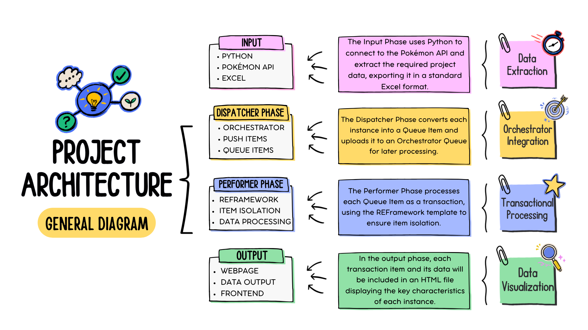

# Automated Transaction Pipeline

This project demonstrates how data is processed within the UiPath ecosystem using supporting tools. The objective is to retrieve data from an external API, process it as transactions using the REFramework template, and generate a webpage output.

A general diagram of the project is shown below.

 

 

## Technologies Used
- Uipath Studio
- Uipath Orchestrator Platform
- Python 
- Excel
- JSON

 

# Project Structure

The project is divided into four stages, as shown in the architecture diagram. Each stage has its own folder and dedicated documentation.
This file serves as the top-level entry point for navigating and understanding the project.
